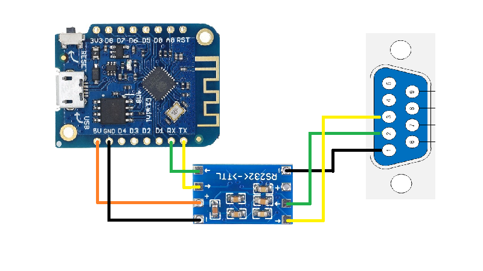

  

# 4heat-esphome-NG21
4heat-esphome NG21 board YAML setup

This is a simple YAML file meant to use with https://github.com/leoshusar/4heat-esphome ESPHome integration specifically for Tiemme NG21 boards. There are added specific datapoints according NG21 specifications that differ from leoshusar initial setup.

### Usage

This is ESPHome yaml file. To use it you have to use ESP8266 or ESP32 board and additional hardware according to istructions. It is possible that it will work with some other boards but it has been tested only with this two. You are fully responsible for any changes to your fireplace hardware or software that you intend to make herewith and for all risks involved.

### Hardware

You need a ESP8266 or ESP32 board, an RS232 to TTL board and some sort of rs232 connector/adapter. It is possible to use any appropriate board but then you have to change wiring on board side. Fireplace should allow you to use RS 232 pin 1-4 for communication. 

### Software

### buffer_thermostat_threshold and buffer_target_temperature

Threshold or also called hysteresis is regulating buffer temperature range when actually fireplace is switched back on. Need for that depends actually how big your buffer is. Factory setup for that is only 2°C. All NG21 boards have similar options but how the manufacturer uses them is different. When you dont use buffer at all with your fireplace, you should remove those 2 options from yaml.

### Night Mode

When you already have night mode in the menu you do not need this part of yaml.
Night Mode menu is to set and enable the beginning and ending time slots of the Night Mode.
The time slots programming is the same as in Chrono Menu. To program it across
midnight, set a time slot until 23.59 and the following from 00.00 to the time of your
choice.
Night Mode allows you to disable in the set time slots the functioning of the following
Engines: Load Engine, Cleaning Engine.
During the set times, the display shows the message
Night Mode.
The menu is displayed only if at least one engine is disabled in Night Mode.

The way how this works in HA is, you will have additional switch to turn those engines for night mode off. When you use it you will have in your stove factory remote/menu settings new item “Night mode”.
I also suggest to add HA automation for power reduction to P3 level so that it will additionally reduce noise levels.

### Combi

This allows to switch between pellet and wood option. To use this uncomment "combi" block. Or if your freplace dont have this option cleanup yaml.
This function has not been tested!!!  
My fireplace does not have this.

### Other datapoints

By the papers I have there is theoretically possible to add additional datapoints but those are mostly related to factory setup and do not add any additional user comfort. 
Unfortunately all passive sensors, (like temperature, pumps and motors) are possible to find only with communication sniffing. When somebody does that for NG21 those can be additionaly added to this yaml. When somebody has discovered some additional important datapoints for this board it is possible to let us know in issues page.

